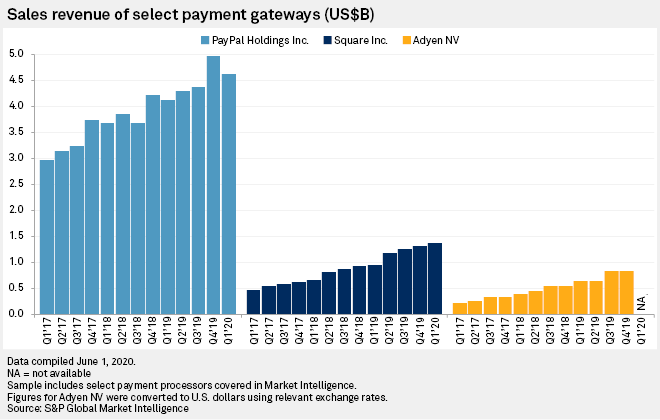
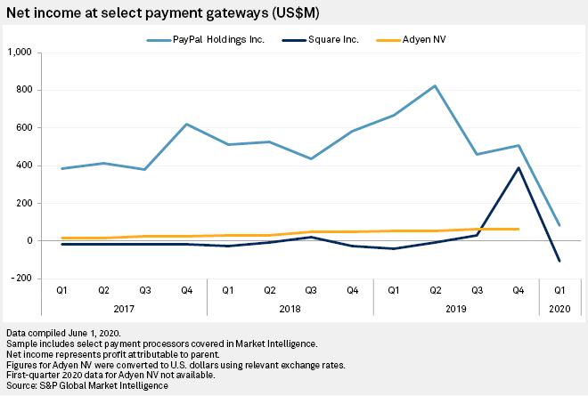

# *Home_Work_1 Square_Case_Study*

# Square Inc 

## Overview and Origin: 

* [Square Inc](https://squareup.com) (Ticker: [SQ](https://finance.yahoo.com/quote/SQ?p=SQ&.tsrc=fin-srch)) 

* Incorporated in: February 1st, 2009 in [St. Louis, Missouri](https://en.wikipedia.org/wiki/St._Louis)

* Founders of the company: [Jack Dorsey](https://en.wikipedia.org/wiki/Jack_Dorsey), [Jim McKelvey](https://en.wikipedia.org/wiki/Jim_McKelvey)

# Idea for the company : 

In 2009 when Jack Dorsey and Jim McKelvey (a friend of Dorsey) were unable to complete a $2,000 sale of glass faucets and fittings because they could not accept credit cards. 

* Funding: 
Square received Angel Investments from :
Marissa Mayer, Kevin Rose, Biz Stone, Dennis Crowley, Shawn Fanning, MC Hammer, and Esther Dyson. 

Rounds of funding :

> Series A funding  November 1st 2009:   $10M   from Khosla Ventures

> Series B funding  January 10th 2011:   $27.5M from Sequoia Capital

> Series C funding  June 28th 2011   :   $100M  from Kleiner Perkins

> Series C funding  December 9th 2011:   $3M    from N/A

> Series D funding  September 17th 2012: $200M  from Citi Ventures, Rizvi Traverse Management, and Starbucks

> Debt Financing    April 7th 2014   :   $100M 

> Series E funding  October 3rd 2014 :   $150M  from Goldman Sachs, Rizvi Traverse Management, and GIC Private Limited.

> Venture Round funding July 2015   : N/A

> IPO November 19,2015 Underwriters: J.P. Morgan, Goldman Sachs, Morgan Stanley.

> Secondary Offering July 31st, 2016

## Business Activities:

Square is an commerce ecosystem and aims to make commerce easy. The Company enables its sellers start, run and grow their businesses. It combines software with hardware to enable sellers to turn mobile devices and computing devices into payments and point-of-sale solutions. The Company enables its sellers start, run and grow their businesses. Square used to accept credit card payments, track sales and inventory, and obtain financing. 

* *Intended customer*:  

Small businesses. In 2019, more than 30 million monthly active users  including small business owners and regular users. 
Small Businesses are “sellers” from the following industries : 
Retail (21%), services(16%), food (16%), health and beauty (11%), contractor (11%), transportation (3%), charities (4%), health service (6%), individuals (8%).

Square Terminal – business owners.  
Square Online Store – small businesses moving online, freelancers who sell goods and services online 
Square Capital – small business owners-borrowers, Paycheck Protection Program applicants.
Cash app ecosystem – regular people. Peer to peer transaction.   

* *What solution does this company offer that their competitors do not or cannot offer? (What is the unfair advantage they utilize?)*

Company started offering a technology capable of aggregating merchant services and mobile payments into a single, easy-to-use service. It made it easy for small businesses to accept credit card payments, track sales and inventory, and obtain financing. Business owners can also use the app to send and track invoices, customize products, email receipts, apply discounts, administer refunds, access real-time sales data, and track inventory in real-time.

Cash App allows uses to use bitcoin. 

* *Which technologies are they currently using, and how are they implementing them?* 

Hardware Technology:
 
Square uses Near-field communication (NFC) technology which is a set of communication protocols for communication between two electronic devices over a distance of 4 cm (11⁄2 in) or less. NFC offers a low-speed connection with simple setup that can be used to bootstrap more-capable wireless connections.  

Mobile App Technology : 

Square uses 63 technology products and services including HTML5, Google Analytics, and Google Fonts.

Patents and Trademarks :

The intellectual property of Square includes 702 registered patents primarily in the 'Computing; Calculating' category. Additionally, Square has registered 48 trademarks with the most popular class being 'Scientific and electric apparatus and instruments'.

## Landscape:

* *What domain of the financial industry is the company in?*

Financial services, Mobile Payment, Point of sale

* *What have been the major trends and innovations of this domain over the last 5-10 years?*
The company expanded in all cashless businesses from the hardware device to cash app ecosystem. Most of the innovations came through the M&A activity. Square made several M&A transaction to innovate and grow in the field of the Mobile Payment and Financial services: 

M&A Activity Track Record : 
1)	Exits: 
-	Emailage provides transactional risk assessment by assessing and scoring email data for organizations around the world.
-	Neumob is the leader in reducing mobile app errors, speeding up app performance and boosting conversions. 
-	Mezi is an AI-powered personal travel assistant, accessible 24x7, over messaging.
-	Caviar food-delivery app

   2). Square has made 12 investments/ acquisitions: 
- ŌURA - is a wellness ring and app designed for user's sleep improvement.
- Transparent Systems is a rewiring global financial settlements and moving money forward services.
- Verse -  Spanish payment App
- Trimian - is a company dedicated to creating new tools for professionals on the go.
- Whatfix - is a digital adoption platform that helps enterprises accelerate the adoption of software applications.
- Bitmovin - is a young and dynamic multimedia company
- Daily.co - offers video chat as an API.
- Mezi - is an AI-powered personal travel assistant, accessible 24x7, over messaging.
- Emailage - provides transactional risk assessment by assessing and scoring email data for organizations around the world.
- Ridecell - is an intelligent platform provider for car sharing, ride sharing and autonomous fleet management.
- Businesses use - BirdEye -  to manage their reviews, be found online, gather customer feedback, improve operations and increase revenue.

* *What are the other major companies in this domain?*

Top Square’s Competitors :

Intuit, 
QuickBooks, 
GoPayment, 
PayPal, 
Adyen, 
ShopKeep, 
Clover, 
Shopify.

## Results

* *What has been the business impact of this company so far?*

Overall impact over the 10 years horizon: 

Increase the speed people exchange money: easy and seamless peer to peer / business to person transfer. Cashless mobile payments with instant exchange. 

Square is less costly than conventional credit card services. This helped merchants of all kinds to use the service to grow their businesses. Square tends to be most useful to merchants who have less than $10,000 in swiped transactions per month. It made lives of entrepreneurs and small business owners easier and payment beyond cash ones . 

Square’s impact during Covid-19: 

Cashless payment spiked during the Covid-19 pandemic. According to Square,  8% of U.S. sellers identified as cashless on March 1. By April 23, that number jumped to 31%. The rapid growth was way beyond what would be considered normal, but then so were widespread quarantines and lockdowns.

* *What are some of the core metrics that companies in this domain use to measure success? How is your company performing, based on these metrics?*

Key Metric:  
Number of transactions, New accounts / New clients to service as merchants, Processing Payment Volume.  

* *How is your company performing relative to competitors in the same domain?*

SQ is in trend with the industry growth especially in the peer-to-peer and online payments. Cash App is showing the higher growth among all SQ’s business segments (CashApp a gross profit grew 115% year over year). Adyen, the Dutch-based B2B financial technology company that handles back-end payments for Uber Technologies Inc., Facebook Inc. and smaller merchants, said its net revenue grew 34% year on year. 
See the graphs for Industry Comparison of PayPal, SQ, and Adyen.

## Recommendations

* *If you were to advise the company, what products or services would you suggest they offer? (This could be something that a competitor offers, or use your imagination!)*

Cashless payments accelerate and pandemic safe. If I were Jack Dorsey I would expand SQ online payments business for the regular people making them pay their household expenses with square (connect all the essential household payments such as ConEdison, Rent Payments, Spectrum etc.) offering cash back if you pay with SQ and giving extra discount on setting an autopay. 
Go international with the peer to peer online apps. Making it easier make wire transfers across the globe. Example: I am a freelancer working remote from Indonesian island, I want to pay my rent for a room I am renting via CashApp or any other app connected to the cashless ecosystem getting a fair currency exchange. 

Future of the work is remote: If people transact via CashApp so it would be easier if peole would get their paychecks to the CashApp too, eliminating the banks. Encorage small businesses to pay their employees directly to mobile apps.  

* *Why do you think that offering this product or service would benefit the company?*

Money flow is higher. Gather information on the customers (Know Your Customer) better serve the needs and provide tailored opportunities. Getting a market share of the retail banks money making mechanisms. 

* *What technologies would this additional product or service utilize?*

Computational Technologies! 

Currency Exchange converter 
Online Banking technology
SWIFT Technology 
Instant deposits (AI in the image recognition)
Face Recognition 
Secure online payments

* *Why are these technologies appropriate for your solution?*
These are the currently used technology by the competitors in the market place. Combining technologies will accelerate the progress in the field. Computational power and combining technologies will provide more opportunities to gain the market share and offer more service to the users. 

## References

  https://en.wikipedia.org/wiki/Square,_Inc.
  https://www.crunchbase.com/organization/square/recent_investments#section-overview
  https://s21.q4cdn.com/114365585/files/doc_financials/2020/Q1/2020-Q1-Shareholder-Letter-Square.pdf
  https://www.investopedia.com/articles/tech/021017/square.asp
  https://www.sec.gov/Archives/edgar/data/1512673/000119312515382249/d937622d424b4.htm
  https://squareup.com/us/en/about
  https://www.crunchbase.com/organization/square/technology#section-overview
  https://www.fundera.com/blog/square-competitors
  https://businessdegrees.uab.edu/blog/how-square-revolutionized-payment-processing/
  https://www.spglobal.com/marketintelligence/en/news-insights/blog/uncertainty-clouds-ovp-vendor-outlook-despite-increased-ott-usage
